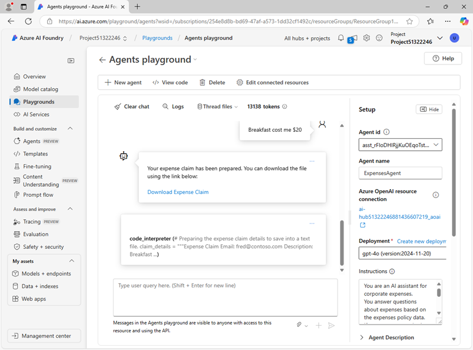

---
lab:
  title: Exploración del desarrollo del agente de IA
  description: Sigue los primeros pasos para desarrollar agentes de IA mientras exploras el Agente de servicio de IA de Azure en el Portal de la Fundición de IA de Azure.
---

# Exploración del desarrollo del agente de IA

En este ejercicio, usarás el Agente de servicio de IA de Azure en el Portal de la Fundición de IA de Azure para crear un agente de IA sencillo que ayude a los empleados con las reclamaciones de gastos.

Este ejercicio dura aproximadamente **30** minutos.

> **Nota**: Algunas de las tecnologías que se usan en este ejercicio se encuentran en versión preliminar o en desarrollo activo. Puede que se produzcan algunos comportamientos, advertencias o errores inesperados.

## Crear un proyecto y un agente de la Fundición de IA de Azure

Comencemos creando un proyecto de Fundición de IA de Azure.

1. En un explorador web, abre el [Portal de la Fundición de IA de Azure](https://ai.azure.com) en `https://ai.azure.com` e inicia sesión con tus credenciales de Azure. Cierra las sugerencias o paneles de inicio rápido que se abran la primera vez que inicias sesión y, si es necesario, usa el logotipo de **Fundición de IA de Azure** en la parte superior izquierda para navegar a la página principal, que es similar a la siguiente imagen (cierra el panel **Ayuda** si está abierto):

    

1. En la página principal, selecciona **Crear un agente**.
1. Cuando se te pida que crees un proyecto, escribe un nombre válido para tu proyecto.
1. Expande **Opciones avanzadas** y especifica los siguientes valores:
    - **Recurso de Fundición de IA de Azure**: *un nombre válido para el recurso de Fundición de IA de Azure*
    - **Suscripción**: *suscripción a Azure*
    - **Grupo de recursos**: *selecciona tu grupo de recursos o crea uno nuevo*
    - **Región**: seleccione cualquiera *(se recomienda Fundición de IA)\**.

    > \* Algunos de los recursos de Azure AI están restringidos por cuotas de modelo regionales. En caso de que se alcance un límite de cuota más adelante en el ejercicio, es posible que tengas que crear otro recurso en otra región.

1. Selecciona **Crear** y espera a que tu proyecto se cree.
1. Si se te solicita, implementa un modelo **gpt-4o** mediante el tipo de implementación **Estándar global** o **Estándar** (en función de la disponibilidad de cuota) y personaliza los detalles de la implementación para establecer un **Límite de velocidad de tokens por minuto** de 50 000 (o el máximo disponible si es inferior a 50 000).

    > **Nota**: reducir el TPM ayuda a evitar el uso excesivo de la cuota disponible en la suscripción que está usando. 50 000 TPM es suficiente para los datos que se usan en este ejercicio. Si la cuota disponible es inferior a esta, podrás completar el ejercicio, pero se pueden producir errores si se supera el límite de velocidad.

1. Cuando se cree el proyecto, el área de juegos de agentes se abrirá automáticamente para que puedas seleccionar o implementar un modelo:

    

    >**Nota**: Un modelo base GPT-4o se implementa automáticamente al crear el agente y el proyecto.

Verás que se ha creado un agente con un nombre predeterminado, junto con la implementación del modelo base.

## Creación del agente

Ahora que has implementado un modelo, estás listo para crear un agente de IA. En este ejercicio, crearás un agente sencillo que responde a preguntas basadas en una directiva de gastos corporativos. Descargarás el documento de la directiva de gastos y lo usarás como datos de *fundamentación* para el agente.

1. Abre otra pestaña del explorador y descarga el documento [Expenses_policy.docx](https://raw.githubusercontent.com/MicrosoftLearning/mslearn-ai-agents/main/Labfiles/01-agent-fundamentals/Expenses_Policy.docx) de `https://raw.githubusercontent.com/MicrosoftLearning/mslearn-ai-agents/main/Labfiles/01-agent-fundamentals/Expenses_Policy.docx` y guárdalo localmente. Este documento contiene detalles de la directiva de gastos de la empresa ficticia Contoso.
1. Vuelve a la pestaña del explorador que contiene el área de juegos de los agentes de fundición y busca el panel **Configuración** (puede estar a un lado o debajo de la ventana de chat).
1. Establece el **Nombre del agente** en `ExpensesAgent`, asegúrate de que la implementación del modelo gpt-4o que has creado anteriormente está seleccionada y establece las **instrucciones** en:

    ```prompt
   You are an AI assistant for corporate expenses.
   You answer questions about expenses based on the expenses policy data.
   If a user wants to submit an expense claim, you get their email address, a description of the claim, and the amount to be claimed and write the claim details to a text file that the user can download.
    ```

    

1. Más abajo, en el panel **Configuración**, junto al encabezado **Conocimientos**, selecciona **+ Agregar**. A continuación, en el cuadro de diálogo **Agregar conocimientos**, selecciona **Archivos**.
1. En el cuadro de diálogo **Agregar archivos**, crea un nuevo almacén de vectores denominado `Expenses_Vector_Store`, cargando y guardando el archivo local **Expenses_policy.docx** que descargaste anteriormente.
1. En el panel **Configuración**, en la sección **Conocimientos**, comprueba que aparece **Expenses_Vector_Store** y que muestra que contiene 1 archivo.
1. Debajo de la sección **Conocimientos**, junto a **Acciones**, selecciona **+ Agregar**. A continuación, en el cuadro de diálogo **Agregar acción**, selecciona **Intérprete de código** y, a continuación, selecciona **Guardar** (no es necesario cargar ningún archivo para el intérprete de código).

    El agente usará el documento que cargaste como origen de conocimiento para *fundamentar* sus respuestas (es decir, responderá a preguntas basadas en el contenido de este documento). Usará la herramienta de intérprete de código según sea necesario para realizar acciones mediante la generación y ejecución de su propio código de Python.

## Prueba del agente

Ahora que has creado un agente, puedes probarlo en el chat del área de juegos.

1. En la entrada del chat del área de juegos, escribe la indicación `What's the maximum I can claim for meals?` y revisa la respuesta del agente, que debería basarse en la información del documento de la directiva de gastos que has agregado como conocimiento al configurar el agente.

    > **Nota**: si el agente no responde es porque se ha superado el límite de frecuencia. Espere unos segundos y vuelve a intentarlo. Si no hay cuota suficiente disponible en la suscripción, es posible que el modelo no pueda responder. Si el problema persiste, intenta aumentar la cuota de tu modelo en la página **Modelos + puntos de conexión**.

1. Prueba la siguiente solicitud de seguimiento: `I'd like to submit a claim for a meal.` y revisa la respuesta. El agente debe pedirte la información necesaria para enviar una notificación.
1. Proporciona al agente una dirección de correo electrónico; por ejemplo, `fred@contoso.com`. El agente debe confirmar la respuesta y solicitar la información restante necesaria para la notificación de gastos (descripción e importe).
1. Envía un mensaje que describa la notificación y el importe; por ejemplo, `Breakfast cost me $20`.
1. El agente debe usar el intérprete de código para preparar el archivo de texto de notificación de gastos y proporcionar un vínculo para que puedas descargarlo.

    

1. Descarga y abre el documento de texto para ver los detalles de la notificación de gastos.

## Limpieza

Ahora que has terminado el ejercicio, debes eliminar los recursos en la nube que has creado para evitar el uso innecesario de recursos.

1. Abre [Azure Portal](https://portal.azure.com) en `https://portal.azure.com` y visualiza el contenido del grupo de recursos donde implementaste los recursos del centro usados en este ejercicio.
1. Selecciona **Eliminar grupo de recursos** en la barra de herramientas.
1. Escribe el nombre del grupo de recursos y confirma que deseas eliminarlo.
