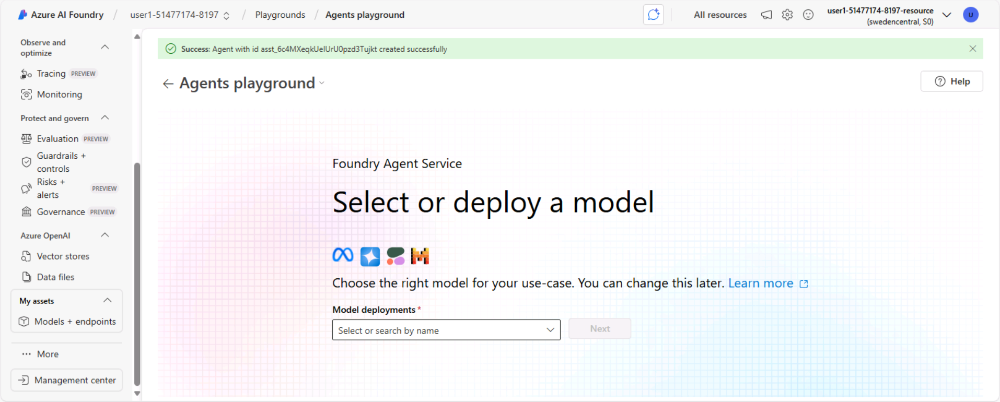

---
lab:
  title: Uso de una función personalizada en un agente de IA
  description: Descubre cómo usar funciones para agregar funcionalidades personalizadas a los agentes.
---

# Uso de una función personalizada en un agente de IA

En este ejercicio, explorarás la creación de un agente que puede usar funciones personalizadas como herramienta para completar tareas.

Crearás un agente de soporte técnico sencillo que puede recopilar los detalles de un problema técnico y generar una incidencia de soporte técnico.

Este ejercicio debería tardar en completarse **30** minutos aproximadamente.

> **Nota**: algunas de las tecnologías que se usan en este ejercicio se encuentran en versión preliminar o en desarrollo activo. Puede que se produzcan algunos comportamientos, advertencias o errores inesperados.

## Creación de un proyecto de Fundición de IA de Azure

Comencemos creando un proyecto de Fundición de IA de Azure.

1. En un explorador web, abre el [Portal de la Fundición de IA de Azure](https://ai.azure.com) en `https://ai.azure.com` e inicia sesión con tus credenciales de Azure. Cierra las sugerencias o paneles de inicio rápido que se abran la primera vez que inicias sesión y, si es necesario, usa el logotipo de **Fundición de IA de Azure** en la parte superior izquierda para navegar a la página principal, que es similar a la siguiente imagen (cierra el panel **Ayuda** si está abierto):

    

1. En la página principal, selecciona **Crear un agente**.
1. Cuando se te pida que crees un proyecto, escribe un nombre válido para el proyecto y expande **Opciones avanzadas**.
1. Confirma los siguientes ajustes para tu proyecto:
    - **Recurso de Fundición de IA de Azure**: *un nombre válido para el recurso de Fundición de IA de Azure*
    - **Suscripción**: *suscripción a Azure*
    - **Grupo de recursos**: *crea o selecciona un grupo de recursos*
    - **Región**: *selecciona cualquier ubicación compatible con los servicios de IA***\*

    > \* Algunos de los recursos de Azure AI están restringidos por cuotas de modelo regionales. En caso de que se alcance un límite de cuota más adelante en el ejercicio, es posible que tengas que crear otro recurso en otra región.

1. Selecciona **Crear** y espera a que tu proyecto se cree.
1. Cuando se cree el proyecto, el área de juegos de agentes se abrirá automáticamente para que puedas seleccionar o implementar un modelo:

    

    >**Nota**: Un modelo base GPT-4o se implementa automáticamente al crear el agente y el proyecto.

1. En el panel de navegación de la izquierda, selecciona **Información general** para ver la página principal del proyecto; que tiene este aspecto:

    > **Nota**: si se muestra un error de *permisos insuficientes**, usa el botón **Reparar** para resolverlo.

    

1. Copia el valor del **punto de conexión del proyecto de la Fundición de IA de Azure** en un Bloc de notas, ya que lo usarás para conectarte a tu proyecto en una aplicación cliente.

## Desarrollo de un agente que usa herramientas de funciones

Ahora que has creado el proyecto en Fundición de IA, vamos a desarrollar una aplicación que implemente un agente mediante herramientas de funciones personalizadas.

### Clonación del repositorio que contiene el código de la aplicación

1. Abre una nueva pestaña del explorador (mantén el Portal de la Fundición de IA de Azure abierto en la pestaña existente). En la nueva pestaña, explora [Azure Portal](https://portal.azure.com) en `https://portal.azure.com` e inicia sesión con tus credenciales de Azure, si se te solicita.

    Cierra las notificaciones de bienvenida para ver la página principal de Azure Portal.

1. Usa el botón **[\>_]** situado a la derecha de la barra de búsqueda en la parte superior de la página para crear una nueva instancia de Cloud Shell en Azure Portal, para lo que deberás seleccionar un entorno de ***PowerShell*** sin almacenamiento en tu suscripción.

    Cloud Shell proporciona una interfaz de la línea de comandos en un panel situado en la parte inferior de Azure Portal. Puedes cambiar el tamaño o maximizar este panel para facilitar el trabajo.

    > **Nota**: si has creado anteriormente una instancia de Cloud Shell que usa un entorno de *Bash*, cámbiala a ***PowerShell***.

1. En la barra de herramientas de Cloud Shell, en el menú **Configuración**, selecciona **Ir a la versión clásica** (esto es necesario para usar el editor de código).

    **<font color="red">Asegúrate de que has cambiado a la versión clásica de Cloud Shell antes de continuar.</font>**

1. En el panel de Cloud Shell, escribe los siguientes comandos para clonar el repositorio de GitHub que contiene los archivos de código de este ejercicio (escribe el comando o cópialo en el Portapapeles y haz clic con el botón derecho en la línea de comandos y pega como texto sin formato):

    ```
   rm -r ai-agents -f
   git clone https://github.com/MicrosoftLearning/mslearn-ai-agents ai-agents
    ```

    > **Sugerencia**: al escribir comandos en CloudShell, la salida puede ocupar una gran cantidad del búfer de pantalla y el cursor en la línea actual puede estar atenuado. Puedes despejar la pantalla al escribir el comando `cls` para que te resulte más fácil centrarte en cada tarea.

1. Escribe el siguiente comando para cambiar el directorio de trabajo a la carpeta que contiene los archivos de código y enumerarlos todos.

    ```
   cd ai-agents/Labfiles/03-ai-agent-functions/Python
   ls -a -l
    ```

    Los archivos proporcionados incluyen código de aplicación y un archivo para las opciones de configuración.

### Configuración de la aplicación

1. En el panel de la línea de comandos de Cloud Shell, escribe el siguiente comando para instalar las bibliotecas que vas a usar:

    ```
   python -m venv labenv
   ./labenv/bin/Activate.ps1
   pip install -r requirements.txt azure-ai-projects
    ```

    >**Nota:** puedes ignorar los mensajes de error o advertencia que se muestran durante la instalación de la biblioteca.

1. Escribe el siguiente comando para editar el archivo de configuración que se ha proporcionado:

    ```
   code .env
    ```

    El archivo se abre en un editor de código.

1. En el archivo de código, reemplaza el marcador de posición **your_project_endpoint** por el punto de conexión de tu proyecto (copiado de la página **Información general** del proyecto del portal de la Fundición de IA de Azure).
1. Después de reemplazar los marcadores de posición, usa el comando **CTRL+S** para guardar los cambios y después usa el comando **CTRL+Q** para cerrar el editor de código mientras mantienes abierta la línea de comandos de Cloud Shell.

### Definición de una función personalizada

1. Escribe el siguiente comando para editar el archivo de código que se ha proporcionado para el código de función:

    ```
   code user_functions.py
    ```

1. Busca el comentario **Crear una función para enviar una incidencia de soporte técnico** y agrega el código siguiente, que generará un número de vale y guarda la incidencia de soporte técnico como un archivo de texto.

    ```python
   # Create a function to submit a support ticket
   def submit_support_ticket(email_address: str, description: str) -> str:
        script_dir = Path(__file__).parent  # Get the directory of the script
        ticket_number = str(uuid.uuid4()).replace('-', '')[:6]
        file_name = f"ticket-{ticket_number}.txt"
        file_path = script_dir / file_name
        text = f"Support ticket: {ticket_number}\nSubmitted by: {email_address}\nDescription:\n{description}"
        file_path.write_text(text)
    
        message_json = json.dumps({"message": f"Support ticket {ticket_number} submitted. The ticket file is saved as {file_name}"})
        return message_json
    ```

1. Busca el comentario **Definir un conjunto de funciones invocables** y agrega el código siguiente, que define estáticamente un conjunto de funciones invocables en este archivo de código (en este caso, solo hay una, pero en una solución real puedes tener varias funciones a las que puede llamar el agente):

    ```python
   # Define a set of callable functions
   user_functions: Set[Callable[..., Any]] = {
        submit_support_ticket
    }
    ```
1. Guarde el archivo (*CTRL + S*).

### Escritura de código para implementar un agente que pueda usar la función

1. Escribe el siguiente comando para empezar a editar el código del agente.

    ```
    code agent.py
    ```

    > **Sugerencia**: al agregar código al archivo de código, asegúrate de mantener la sangría correcta.

1. Revisa el código existente, que recupera los valores de configuración de la aplicación y configura un bucle en el que el usuario puede escribir indicaciones para el agente. El resto del archivo incluye comentarios en los que agregarás el código necesario para implementar el agente de soporte técnico.
1. Busca el comentario **Agregar referencias** y agrega el código siguiente para importar las clases que necesitarás para crear un agente de Azure AI que use el código de función como herramienta:

    ```python
   # Add references
   from azure.identity import DefaultAzureCredential
   from azure.ai.agents import AgentsClient
   from azure.ai.agents.models import FunctionTool, ToolSet, ListSortOrder
   from user_functions import user_functions
    ```

1. Busca el comentario **Conectar con el cliente del agente** y agrega el siguiente código para conectarte al proyecto Azure AI mediante las credenciales actuales de Azure.

    > **Sugerencia**: ten cuidado de mantener el nivel de sangría correcto.

    ```python
   # Connect to the Agent client
   agent_client = AgentsClient(
       endpoint=project_endpoint,
       credential=DefaultAzureCredential
           (exclude_environment_credential=True,
            exclude_managed_identity_credential=True)
   )
    ```
    
1. Busca la sección del comentario **Definir un agente que pueda usar las funciones personalizadas** y agrega el código siguiente para agregar el código de función como un conjunto de herramientas. A continuación, crea un agente que pueda usar el conjunto de herramientas y un hilo en el que ejecutar la sesión de chat.

    ```python
   # Define an agent that can use the custom functions
   with agent_client:

        functions = FunctionTool(user_functions)
        toolset = ToolSet()
        toolset.add(functions)
        agent_client.enable_auto_function_calls(toolset)
            
        agent = agent_client.create_agent(
            model=model_deployment,
            name="support-agent",
            instructions="""You are a technical support agent.
                            When a user has a technical issue, you get their email address and a description of the issue.
                            Then you use those values to submit a support ticket using the function available to you.
                            If a file is saved, tell the user the file name.
                         """,
            toolset=toolset
        )

        thread = agent_client.threads.create()
        print(f"You're chatting with: {agent.name} ({agent.id})")

    ```

1. Busca el comentario **Enviar una indicación al agente** y agrega el código siguiente para agregar la indicación del usuario como mensaje y ejecutar la conversación.

    ```python
   # Send a prompt to the agent
   message = agent_client.messages.create(
        thread_id=thread.id,
        role="user",
        content=user_prompt
   )
   run = agent_client.runs.create_and_process(thread_id=thread.id, agent_id=agent.id)
    ```

    > **Nota**: el uso del método **create_and_process** para ejecutar el hilo permite al agente buscar automáticamente las funciones y elegir usarlas en función de sus nombres y parámetros. Como alternativa, puedes usar el método **create_run**, en cuyo caso serías responsable de escribir código para sondear el estado de ejecución con el fin de determinar cuándo se requiere una llamada a la función para llamarla y devolver los resultados al agente.

1. Busca el comentario **Comprobar el estado de ejecución de los errores** y agrega el código siguiente para mostrar los errores que se producen.

    ```python
   # Check the run status for failures
   if run.status == "failed":
        print(f"Run failed: {run.last_error}")
    ```

1. Busca el comentario **Mostrar la respuesta más reciente del agente** y agrega el código siguiente para recuperar los mensajes del hilo completado y mostrar el último mensaje enviado por el agente.

    ```python
   # Show the latest response from the agent
   last_msg = agent_client.messages.get_last_message_text_by_role(
       thread_id=thread.id,
       role=MessageRole.AGENT,
   )
   if last_msg:
        print(f"Last Message: {last_msg.text.value}")
    ```

1. Busca el comentario **Obtener el historial de conversaciones** y agrega el siguiente código para imprimir los mensajes del hilo de conversación; ordenándolos en secuencia cronológica

    ```python
   # Get the conversation history
   print("\nConversation Log:\n")
   messages = agent_client.messages.list(thread_id=thread.id, order=ListSortOrder.ASCENDING)
   for message in messages:
       if message.text_messages:
           last_msg = message.text_messages[-1]
           print(f"{message.role}: {last_msg.text.value}\n")
    ```

1. Busca el comentario **Limpiar** y agrega el código siguiente para eliminar el agente y el hilo cuando ya no sea necesario.

    ```python
   # Clean up
   agent_client.delete_agent(agent.id)
   print("Deleted agent")
    ```

1. Revisa el código mediante los comentarios para comprender cómo:
    - Agrega el conjunto de funciones personalizadas a un conjunto de herramientas
    - Crea un agente que usa el conjunto de herramientas.
    - Ejecuta un hilo con un mensaje de indicación del usuario.
    - Comprueba el estado de la ejecución en caso de que se produzca un error.
    - Recupera los mensajes del hilo completado y muestra el último mensaje enviado por el agente.
    - Muestra el historial de conversaciones
    - Elimina el agente y el hilo cuando ya no son necesarios.

1. Guarda el archivo de código (*CTRL+S*) cuando hayas terminado. También puede cerrar el editor de código (*CTRL+Q*); aunque es posible que desees mantenerlo abierto en caso de que tengas modificar el código que agregaste. En cualquier caso, no cierres el panel de línea de comandos de Cloud Shell.

### Inicie sesión en Azure y ejecuta la aplicación.

1. En el panel de línea de comandos de Cloud Shell, escribe el siguiente comando para iniciar sesión en Azure.

    ```
    az login
    ```

    **<font color="red">Debes iniciar sesión en Azure, aunque la sesión de Cloud Shell ya esté autenticada.</font>**

    > **Nota**: en la mayoría de los escenarios, el uso de *inicio de sesión de az* será suficiente. Sin embargo, si tienes suscripciones en varios inquilinos, es posible que tengas que especificar el inquilino mediante el parámetro *--tenant*. Consulta [Inicio de sesión en Azure de forma interactiva mediante la CLI de Azure](https://learn.microsoft.com/cli/azure/authenticate-azure-cli-interactively) para obtener más información.
    
1. Cuando se te solicite, sigue las instrucciones para abrir la página de inicio de sesión en una nueva pestaña y escribe el código de autenticación proporcionado y las credenciales de Azure. A continuación, completa el proceso de inicio de sesión en la línea de comandos y selecciona la suscripción que contiene el centro de Fundición de IA de Azure si se te solicita.
1. Después de iniciar sesión, escribe el siguiente comando para ejecutar la aplicación:

    ```
   python agent.py
    ```
    
    La aplicación se ejecuta con las credenciales de la sesión de Azure autenticada para conectarse al proyecto y crear y ejecutar el agente.

1. Cuando se te solicite, escribe una indicación como:

    ```
   I have a technical problem
    ```

    > **Sugerencia**: si se produce un error en la aplicación porque se supera el límite de velocidad. Espere unos segundos y vuelve a intentarlo. Si no hay cuota suficiente disponible en la suscripción, es posible que el modelo no pueda responder.

1. Visualiza la respuesta. El agente puede pedir tu dirección de correo electrónico y una descripción del problema. Puede usar cualquier dirección de correo electrónico (por ejemplo, `alex@contoso.com`) y cualquier descripción del problema (como `my computer won't start`).

    Cuando tenga suficiente información, el agente debe elegir usar la función según sea necesario.

1. Puedes continuar la conversación si lo deseas. El hilo está *con estado*, por lo que conserva el historial de conversaciones, lo que significa que el agente tiene el contexto completo para cada respuesta. Cuando hayas terminado, escribe `quit`.
1. Revisa los mensajes de la conversación que se recuperaron del hilo y los vales que se generaron.
1. La herramienta debe haber guardado incidencias de soporte técnico en la carpeta de la aplicación. Puedes usar el comando `ls` para comprobar y usar el comando `cat` para ver el contenido del archivo, de la siguiente manera:

    ```
   cat ticket-<ticket_num>.txt
    ```

## Limpieza

Ahora que has terminado el ejercicio, debes eliminar los recursos en la nube que has creado para evitar el uso innecesario de recursos.

1. Abre [Azure Portal](https://portal.azure.com) en `https://portal.azure.com` y visualiza el contenido del grupo de recursos donde implementaste los recursos del centro usados en este ejercicio.
1. Selecciona **Eliminar grupo de recursos** en la barra de herramientas.
1. Escribe el nombre del grupo de recursos y confirma que deseas eliminarlo.
